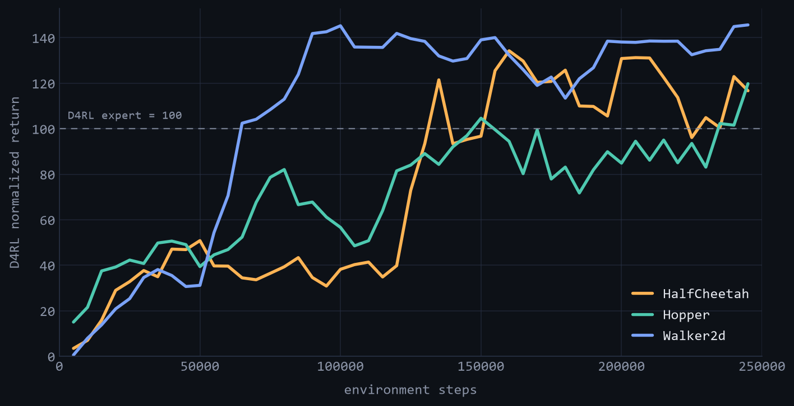
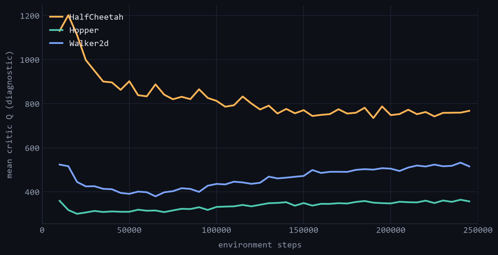

<div align="center">

# RLPD // OFFLINE→ONLINE RL

**Offline data + live practice — a from-scratch PyTorch reproduction of RLPD, a check of *why* it works, and a push past the paper to Humanoid.**


<br>

&nbsp;
&nbsp;


<sub>Trained <b>250k</b> seed-0 policies rolling out in MuJoCo — Hopper <b>98</b> · Walker2d <b>139</b> · HalfCheetah <b>110</b> normalized (D4RL)</sub>

</div>

---

A reproduction study of **RLPD** — *Efficient Online Reinforcement Learning with Offline Data*
(Ball, Smith, Kostrikov & Levine, ICML 2023) — reimplemented in **PyTorch** on
[Minari](https://minari.farama.org/) offline datasets and Gymnasium MuJoCo, then **extended to
`Humanoid-v5`**, which the original paper never tested. Runs end-to-end on a single desktop GPU.

## The idea

> RLPD's claim: you don't need a specialised offline-RL algorithm to use offline data. Run
> standard off-policy **SAC**, feed it the dataset through a 50/50 online↔offline mix, and add three
> safeguards so the value function can't diverge when the agent starts exploring.

The three modifications — this *is* the method:

1. **Symmetric sampling** — every training batch is 50% fresh online replay, 50% offline data.
2. **LayerNorm critic** — LayerNorm bounds Q-values on out-of-distribution actions (the divergence fix).
3. **Ensemble + high UTD** — a 10-critic ensemble with 20 gradient updates per environment step.

Everything else (CDQ, entropy backups, 2-vs-3 critic layers) is a per-task knob — i.e. the ablations.

## Results

**Full-length runs — seed 0, 250k env-steps per task** (seeds 1–2 still scaling up).
D4RL-normalized against the Minari expert datasets; measured on an RTX 5070 (Blackwell, 12 GB).

<p align="center"></p>

| Task | Setting | Seeds | Env-steps | Final return | Normalized (D4RL) | Mean Q |
| :--- | :---: | :---: | :---: | :---: | :---: | :---: |
| Hopper-v5      | RLPD | 1 | 245,000 | 3,748  | **97.8**  | 355 |
| Walker2d-v5    | RLPD | 1 | 245,000 | 6,630  | **138.8** | 515 |
| HalfCheetah-v5 | RLPD | 1 | 245,000 | 16,748 | **109.6** | 757 |

> **Scores above 100 are expected here.** Normalization is D4RL-style (random = 0, expert = 100),
> but the Minari **v5 expert datasets are stronger** than the original D4RL expert reference — so
> reaching ~98–139 means the policy matched or passed that bar.

**Findings**

- **All three tasks pass the D4RL expert line (100) within the 250k budget** — off expert-seeded
  offline data. Walker2d leads (~139), HalfCheetah ~110, Hopper ~98.
- **The critic stays bounded.** Mean Q rises then *plateaus* on every task, even over the full
  horizon — no value explosion. Bounded Q is the mechanism behind the stable returns, and confirms
  LayerNorm + the ensemble are doing their job.
- **Single desktop GPU, $0 cloud.** State-based MuJoCo (small MLPs) — one RTX 5070 covers the whole
  plan, Humanoid included.
- **Seed 0 at the full horizon; seeds 1–2 still training.** An earlier 3-seed **60k** progression
  preview reached 39–51 normalized before the full runs.

<p align="center"></p>
<p align="center"><sub>Mean critic Q rises then <b>plateaus</b> on every task — bounded, not diverging: the mechanism behind the stable returns.</sub></p>

## Method

RLPD core (paper Table 1), set in [`config.yaml`](config.yaml):

| ensemble | UTD | mix | LayerNorm | γ | lr | critic EMA | hidden |
| :---: | :---: | :---: | :---: | :---: | :---: | :---: | :---: |
| 10 | 20 | 0.5 | on | 0.99 | 3e-4 | 0.005 | 256 |

Modules code against the frozen interfaces in `rlpd/interfaces.py` (the batch contract +
`Buffer`/`Agent` protocols), so the algorithm, data, and env layers stay swappable.

## Reproduce

Requires Python 3.11+ and an NVIDIA GPU (CUDA 12.8+ for RTX 50-series).

```powershell
./setup.ps1                       # venv + PyTorch (cu128) + requirements + setup check
python check_setup.py             # verify GPU, MuJoCo env, Minari dataset, and logging

python run.py                     # train Hopper from config.yaml defaults
python run.py --set env.id=Walker2d-v5 dataset.minari_id=mujoco/walker2d/expert-v0 experiment.seed=1
python run.py --stub --steps 50 --wandb-offline --device cpu   # wiring check (no GPU/data needed)

python demo.py --episodes 5       # roll out a trained checkpoint (deterministic policy)
python plotting/make_curves.py    # learning curves + summary table
python budget.py                  # compute-budget accounting + projection
```

Any task/seed/ablation is a dotted override via `--set` (e.g. `algo.utd=1`, `algo.layernorm=false`).
Runs log to [W&B](https://wandb.ai/) as `NR1_[Env]_[Setting]_[Seed]` with seed, dataset version, and
commit recorded for reproducibility.

## Repository layout

```
rlpd/
  interfaces.py     batch contract + Buffer/Agent protocols
  stubs.py          MockBuffer, StubAgent (wiring tests)
  networks.py       Actor, EnsembleCritic
  sac.py            RLPD/SAC agent
  replay_buffer.py  online buffer + symmetric sampler
  dataset.py        Minari → offline buffer
  envs.py           env creation + wrappers
  evaluate.py       eval loop
train.py            training loop (wires the interfaces)
run.py              CLI launcher (config + --set overrides)
wandb_logger.py     logging
config.yaml         hyperparameters (paper Tables 1–2)
setup.ps1           environment bootstrap
check_setup.py      pipeline verification
```

## Roadmap

- [x] Locomotion reproduction — Hopper / HalfCheetah / Walker2d, 3 seeds (60k progression)
- [x] Logging, compute-budget accounting, and plotting pipeline
- [x] Humanoid offline loader + env prep
- [x] Full-length **250k-step** runs — seed 0, all three tasks past the D4RL expert line
- [ ] Seeds 1–2 to 250k — full 3-seed aggregate at the paper horizon
- [ ] Component ablations — symmetric ratio · LayerNorm · ensemble size · UTD
- [ ] **Humanoid-v5 / HumanoidStandup** extension (beyond the paper)
- [ ] Baselines — SAC-from-demos · IQL + fine-tuning

## References

[RLPD — Efficient Online RL with Offline Data](https://arxiv.org/abs/2302.02948) (Ball et al., ICML 2023) ·
[reference implementation](https://github.com/ikostrikov/rlpd) ·
[Minari](https://minari.farama.org/) ·
[Gymnasium MuJoCo](https://gymnasium.farama.org/environments/mujoco/)

MIT — see [`LICENSE`](LICENSE).
