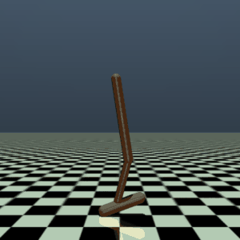
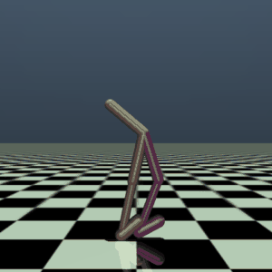
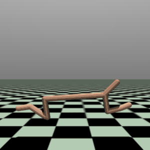
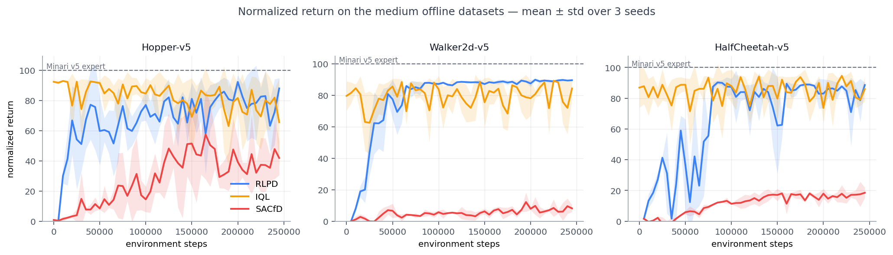
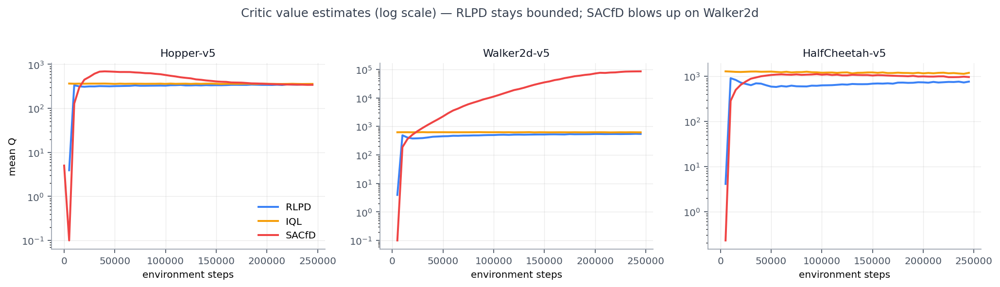

<div align="center">

# RLPD // OFFLINE→ONLINE RL

**PyTorch reproduction of RLPD (offline-to-online RL) on MuJoCo locomotion, with a Humanoid extension.**


<br>

&nbsp;
&nbsp;


<sub>Trained <b>245k</b> seed-0 policies (expert offline data) rolling out in MuJoCo — Hopper <b>97</b> · Walker2d <b>97</b> · HalfCheetah <b>103</b> normalized (Minari v5 expert = 100)</sub>

</div>

---

A reproduction study of **RLPD** — *Efficient Online Reinforcement Learning with Offline Data*
(Ball, Smith, Kostrikov & Levine, ICML 2023) — reimplemented in **PyTorch** on
[Minari](https://minari.farama.org/) offline datasets and Gymnasium MuJoCo, then **extended to
`Humanoid-v5`**, which the original paper never tested. Runs end-to-end on a single desktop GPU.

## The idea

> RLPD's claim: you don't need a specialised offline-RL algorithm to use offline data. Run
> standard off-policy **SAC**, feed it the dataset through a 50/50 online↔offline mix, and add three
> safeguards so the value function can't diverge when the agent starts exploring.

The three modifications:

1. **Symmetric sampling** — every training batch is 50% fresh online replay, 50% offline data.
2. **LayerNorm critic** — LayerNorm bounds Q-values on out-of-distribution actions (the divergence fix).
3. **Ensemble + high UTD** — a 10-critic ensemble with 20 gradient updates per environment step.

Everything else (CDQ, entropy backups, 2-vs-3 critic layers) is a per-task knob — i.e. the ablations.

## Results

**3 seeds × 3 methods × 245k env-steps per run**, on the **medium**-quality Minari offline
datasets; measured on an RTX 5070 (Blackwell, 12 GB).

<p align="center"></p>

Scores are normalized so that **the Minari v5 expert dataset = 100** and a random policy = 0.
`final` is the last evaluation of each run, averaged over seeds; `last-5` averages each run's
final five evaluations first, which strips most of the per-eval noise. Where the two disagree
(Hopper, HalfCheetah) the run is still swinging between evals — read the pair, not either alone.

| Task | Method | Final (mean ± std) | Last-5 | Final raw | Mean Q |
| :--- | :--- | :---: | :---: | ---: | ---: |
| **Hopper-v5** | **RLPD** | **88.0 ± 6.8** | 77.8 | 3,397 | 347 |
| | IQL | 65.6 ± 29.2 | 74.9 | 2,538 | 359 |
| | SACfD | 41.9 ± 11.3 | 39.9 | 1,629 | 342 |
| **Walker2d-v5** | **RLPD** | **89.6 ± 0.7** | 89.4 | 6,138 | 545 |
| | IQL | 84.3 ± 6.6 | 82.0 | 5,776 | 620 |
| | SACfD | 8.1 ± 2.1 | 7.6 | 559 | 85,300 |
| **HalfCheetah-v5** | **RLPD** | **88.6 ± 1.6** | 81.6 | 14,356 | 766 |
| | IQL | 86.0 ± 7.8 | 84.9 | 13,926 | 1,198 |
| | SACfD | 18.5 ± 3.4 | 17.1 | 2,788 | 966 |

**Findings**

- RLPD reaches 88–90% of the Minari v5 expert on all three tasks, and it is the only method
  that does so on all three.
- Its advantage is consistency more than peak score. IQL is competitive on final return
  (86.0 on HalfCheetah, 84.3 on Walker2d) but far noisier across seeds: RLPD's seed std is
  0.7 / 1.6 / 6.8 against IQL's 6.6 / 7.8 / 29.2. On Hopper, IQL's spread is wide enough that
  the two overlap, so the honest claim there is a lower-variance tie.
- SACfD collapses, exactly as the paper predicts for naive SAC on a shared offline+online
  buffer: 8.1 on Walker2d and 18.5 on HalfCheetah, with the Walker2d critic running away to
  a mean Q around 85,000 while RLPD sits at 545.
- RLPD's value estimates stay bounded. Mean Q rises then plateaus on every task, with no
  divergence, consistent with LayerNorm and the ensemble bounding out-of-distribution Q.
- Everything fits one desktop GPU. State-based MuJoCo means small MLPs, and a single RTX 5070
  covers the full plan.

<p align="center"></p>
<p align="center"><sub>RLPD's mean <i>Q</i> plateaus on every task. SACfD's Walker2d critic diverges by two orders of magnitude.</sub></p>

### Offline data quality

The same RLPD configuration, swept over the three Minari dataset qualities — better offline data
monotonically buys a better online policy:

| Task | simple | medium | expert |
| :--- | :---: | :---: | :---: |
| Hopper-v5 | 74.0 ± 21.2 | 88.0 ± 6.8 | 97.1 |
| Walker2d-v5 | 78.3 ± 5.9 | 89.6 ± 0.7 | 96.8 |
| HalfCheetah-v5 | 65.5 ± 1.5 | 88.6 ± 1.6 | 103.1 |

> `simple` and `medium` are 3-seed means ± std at 245k steps. The **expert** column is
> **seed 0 only** — seeds 1–2 on the expert datasets stopped at 57.5k and are not comparable,
> so no std is reported. HalfCheetah passing 100 means it edged the expert dataset it learned from.

### Humanoid-v5 — beyond the paper

`Humanoid-v5` is not in the RLPD paper. It is also much harder: 3 seeds at ~1M env-steps are
still early, and the honest number is low.

| Method | Seeds | Env-steps | Final normalized | Critic |
| :--- | :---: | :--- | :---: | :--- |
| **RLPD** | 3 | 995k · 995k · 715k *(still training)* | 5.0 ± 2.4 | bounded, mean Q ≈ 518 |
| SACfD | 3 | 995k · 550k · 430k | 6.2 ± 3.0 | **diverged to NaN on 2 of 3 seeds** |

The interesting result here is the failure, not the score. **SACfD's critic exploded to
mean Q ≈ 4e10 (critic loss ≈ 6e17) before producing NaN** on seeds 1 and 2 — the precise
instability that RLPD's LayerNorm critic and ensemble exist to prevent. RLPD stayed bounded on
all three seeds at the same budget. Divergences are recorded rather than retried or patched, so
the baseline stays like-for-like — see `results/*.DIVERGED.txt`.

## Method

RLPD core (paper Table 1), set in [`config.yaml`](config.yaml):

| ensemble | UTD | mix | LayerNorm | γ | lr | critic EMA | hidden |
| :---: | :---: | :---: | :---: | :---: | :---: | :---: | :---: |
| 10 | 20 | 0.5 | on | 0.99 | 3e-4 | 0.005 | 256 |

Modules code against the frozen interfaces in `rlpd/interfaces.py` (the batch contract +
`Buffer`/`Agent` protocols), so the algorithm, data, and env layers stay swappable.

### Normalization — why not D4RL constants

The paper reports **D4RL-normalized** scores. This reproduction trains on **Minari v5** datasets,
whose experts are stronger than D4RL's old reference — under D4RL constants the v5 expert *data
itself* scores 119% (Hopper), 149% (Walker2d) and 133% (HalfCheetah), which makes any number
above 100 meaningless as a quality signal.

So scores here normalize to the **Minari v5 expert = 100**, measured 2026-07-19:

| Env | random policy | Minari v5 expert | *(D4RL expert, for reference)* |
| :--- | ---: | ---: | ---: |
| Hopper-v5 | 24.8 | 3,857.8 | *3,234.3* |
| Walker2d-v5 | 2.2 | 6,847.8 | *4,592.3* |
| HalfCheetah-v5 | −261.6 | 16,242.9 | *12,135.0* |
| Humanoid-v5 | 105.6 | 8,602.9 | *not in D4RL* |

`normalized = 100 × (raw − random) / (expert − random)`

Comparison against the paper is therefore by **ranking and trend** (RLPD ≥ IQL ≫ SACfD), not by
absolute number. Every eval CSV stores `return_raw`, so changing the reference is an offline
recompute — `python recompute_normalized.py` — with no re-training.

## Reproduce

Requires Python 3.11+ and an NVIDIA GPU (CUDA 12.8+ for RTX 50-series).

```powershell
./setup.ps1                       # venv + PyTorch (cu128) + requirements + setup check
python check_setup.py             # verify GPU, MuJoCo env, Minari dataset, and logging

python run.py                     # train Hopper from config.yaml defaults
python run.py --set env.id=Walker2d-v5 dataset.minari_id=mujoco/walker2d/expert-v0 experiment.seed=1
python run.py --stub --steps 50 --wandb-offline --device cpu   # wiring check (no GPU/data needed)

python demo.py --episodes 5       # roll out a trained checkpoint (deterministic policy)
python budget.py                  # compute-budget accounting + projection

python -m plotting.make_curves          # per-env curves + figures/summary_table.md
python -m plotting.make_readme_figures  # the two figures embedded above
python recompute_normalized.py          # re-derive return_normalized from return_raw
```

Any task/seed/ablation is a dotted override via `--set` (e.g. `algo.utd=1`, `algo.layernorm=false`).
Runs log to [W&B](https://wandb.ai/) as `NR1_[Env]_[Setting]_[Seed]` with seed, dataset version, and
commit recorded for reproducibility.

## Repository layout

```
rlpd/
  interfaces.py     batch contract + Buffer/Agent protocols
  stubs.py          MockBuffer, StubAgent (wiring tests)
  networks.py       Actor, EnsembleCritic
  sac.py            RLPD/SAC agent
  replay_buffer.py  online buffer + symmetric sampler
  dataset.py        Minari → offline buffer
  envs.py           env creation + wrappers
  evaluate.py       eval loop
train.py            training loop (wires the interfaces)
run.py              CLI launcher (config + --set overrides)
wandb_logger.py     logging + normalization reference scores
config.yaml         hyperparameters (paper Tables 1–2)
setup.ps1           environment bootstrap
check_setup.py      pipeline verification
budget.py           compute-budget accounting
recompute_normalized.py   re-derive return_normalized from return_raw (no re-training)
plotting/
  make_curves.py            per-env curves + figures/summary_table.md
  make_readme_figures.py    the two figures embedded in this README
results/            per-run eval CSVs (+ *.DIVERGED.txt notes)
```

## Roadmap

- [x] Locomotion reproduction — Hopper / HalfCheetah / Walker2d
- [x] Logging, compute-budget accounting, and plotting pipeline
- [x] Humanoid offline loader + env prep
- [x] Full-length **245k-step** runs — **3 seeds × 3 methods** on the medium datasets
- [x] Baselines — SAC-from-demos (SACfD) · IQL + fine-tuning
- [x] Offline data-quality sweep — simple / medium / expert
- [x] Minari v5 normalization (replacing the D4RL constants)
- [ ] **Humanoid-v5** to the full budget on all 3 seeds — currently ~5 normalized at ~1M steps
- [ ] Component ablations — symmetric ratio · LayerNorm · ensemble size · UTD
- [ ] Expert-dataset runs for seeds 1–2 (stopped at 57.5k; seed 0 only at the full horizon)
- [ ] HumanoidStandup

## References

[RLPD — Efficient Online RL with Offline Data](https://arxiv.org/abs/2302.02948) (Ball et al., ICML 2023) ·
[reference implementation](https://github.com/ikostrikov/rlpd) ·
[Minari](https://minari.farama.org/) ·
[Gymnasium MuJoCo](https://gymnasium.farama.org/environments/mujoco/)

MIT — see [`LICENSE`](LICENSE).
